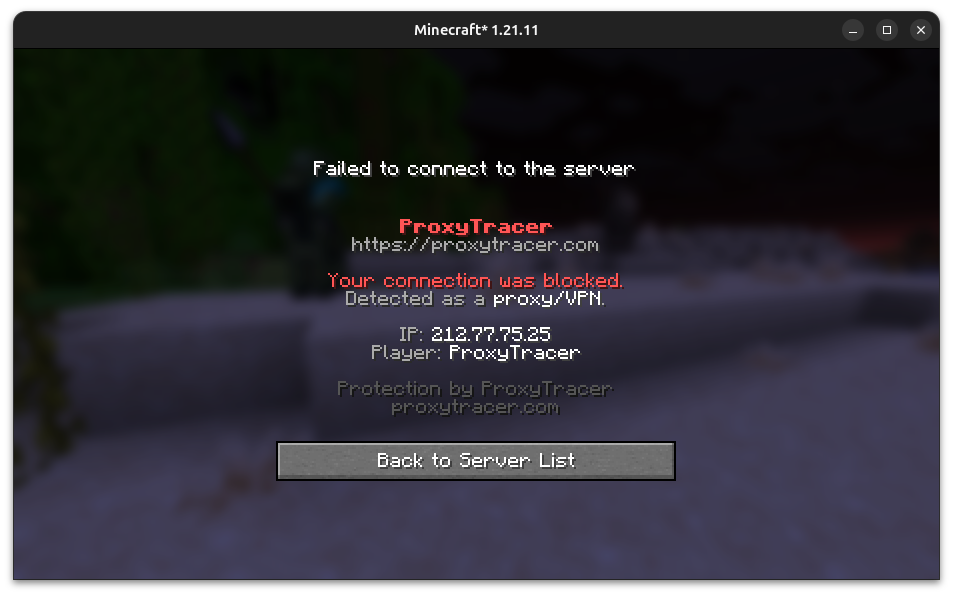
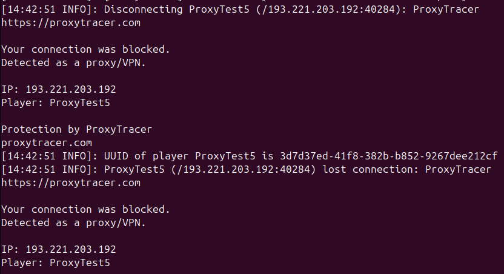

# ProxyTracer for Minecraft (Paper, Velocity & Bungee)

**Stop VPN and proxy connections before they join your game world.**

ProxyTracer checks joining player IPs against the high-accuracy [ProxyTracer API](https://proxytracer.com) and allows you to **block**, **warn**, or **log** malicious connections. Perfect for stopping ban evasion, alts, and VPN-based bot raids.

[](https://proxytracer.com)
[](../../releases)
[](#which-jar-do-i-install)

---

### Preview

| In-Game Kick Screen | Console Warning Alert |
|---|---|
|  |  |

---

## Why ProxyTracer?

- **Real-Time Detection:** Accurate checks against proxytracer.com's constantly updated residential and public VPN databases.
- **Multi-Platform Native:** Dedicated integrations for single servers (**Paper/Spigot**) and multi-server networks (**Velocity** or **BungeeCord/Waterfall**).
- **Fast Performance:** Built-in in-memory caching saves API credits and ensures returning players connect instantly.
- **Smart Whitelist:** Whitelist bypass commands for trusted player names and network IPs.
- **Discord Alerts:** Log blocked VPN joins directly to your staff channels.
- **Branded Kick Screen:** Prompts players with a professional block message citing `proxytracer.com`.

---

## Which jar do I install?

| Your setup | Install this jar | Location |
|---|---|---|
| Single **Paper / Spigot / Purpur** server | `proxytracer-bukkit-1.2.0.jar` | Game server `plugins/` |
| **Velocity** proxy network | `proxytracer-velocity-1.2.0.jar` | Proxy server `plugins/` (Do not install on Paper) |
| **BungeeCord / Waterfall** network | `proxytracer-bungee-1.2.0.jar` | Proxy server `plugins/` (Do not install on Paper) |

> [!IMPORTANT]
> **Rule:** Install ProxyTracer **where the real client IP is visible**. 
> If you run a proxy network (Velocity or BungeeCord), install it **only** on the proxy. Do not run both Bukkit and Velocity plugins in block mode (this results in double-billing and redundant checks).

---

## Quick Setup (60 Seconds)

1. Get a free API key at **[ProxyTracer.com](https://proxytracer.com/dashboard)**.
2. Download the correct jar for your setup from [Releases](../../releases).
3. Place the jar in your server's `plugins/` directory and start it once.
4. Set your API key directly in-game or via the console:
   ```text
   /proxytracer set your_api_key_here
   ```
   *(This automatically writes the key to your config file and reloads the plugin).*
5. Verify the connection by running:
   ```text
   /proxytracer status
   ```

---

## Configuration Highlight

```yaml
mode: "block"          # Action when proxy detected: block | warn | log

api:
  base-url: "https://api.proxytracer.com/v1"
  key: "proxy_your_key_here"
  on-error: "allow"    # Fail-open policy if API goes offline: allow | block | warn
  timeout-ms: 2000

cache:
  enabled: true
  ttl-minutes: 1440    # Cache IP check result for 24 hours
  max-entries: 10000

discord:
  enabled: false
  webhook-url: ""
  notify-blocked: true
```

---

## Commands & Permissions

All commands are prefixed with `/proxytracer`:

* `/proxytracer set <api_key>` — Set the API key directly, saving it to config.yml and reloading.
* `/proxytracer status` — Check configuration status and API credentials.
* `/proxytracer check <ip>` — Query an IP address manually.
* `/proxytracer cache clear` — Clear the local IP cache.
* `/proxytracer reload` — Reload the configuration file.
* `/proxytracer whitelist name add|remove|list [player]` — Exempt players from checks.
* `/proxytracer whitelist ip add|remove|list [ip]` — Exempt network IPs from checks.

### Permissions:
- `proxytracer.admin` — Access to reload, status, and administration commands.
- `proxytracer.bypass` — Players with this permission bypass check requirements during pre-login.
- `proxytracer.notify` — Staff receive in-game warnings when a VPN user is logged or warned.

*(Note: By default, these permissions are assigned only to server Operators (OPs). To grant these permissions to other players or staff groups, use a permissions manager plugin like LuckPerms).*

---

## Compatibility & Requirements

* **Java Version:** **Java 17 or higher** (fully tested on Java 17, 21, and 22). The plugin is compiled targeting Java 17.
* **Server Software Support:**
  * **Paper / Spigot / Purpur:** Minecraft **1.13 to 1.21.x** (specifically tested and verified working on Paper 1.21).
  * **Velocity:** **3.x**
  * **BungeeCord / Waterfall:** Modern builds.
* **API Access:** A free or paid API key registered at [proxytracer.com](https://proxytracer.com).

---

## Troubleshooting: Real IP Issues (`127.0.0.1`)

If your logs show every joining player connecting from `127.0.0.1`, the ProxyTracer API cannot scan them. This indicates your hosting network layout or front-end proxy is masking the incoming player IPs.

### How to Fix:
1. **For Proxy Networks (Velocity / Bungee):** 
   - Deploy ProxyTracer **only on the gateway proxy** (Velocity/Bungee). 
   - Ensure player info forwarding is active (`player-info-forwarding-mode = "modern"` in `velocity.toml` or `ip_forward: true` in Bungee's `config.yml`) so the backend game nodes receive the real IP.
2. **For Shared Hosts (e.g., TickHosting panel proxies):** 
   - If your host forwards connection headers via Proxy Protocol, enable it inside your Paper configuration:
     * Open `config/paper-global.yml`
     * Set:
       ```yaml
       proxies:
         proxy-protocol: true
       ```
     * Restart the server.
     * *Warning: Do not turn this on unless your host explicitly supports it; configuring it incorrectly will prevent all players from joining.*

---

## Pricing & API Quotas

The ProxyTracer Minecraft plugins are 100% free. Detection requires a connection to the ProxyTracer API:
- **Free Tier:** 100 checks/month for small SMPs and development.
- **Starter (€3/mo):** Perfect for growing public servers.
- **Pro (€9/mo) / Scale (€39/mo):** Intended for established networks.

Create your key & select a plan: **[ProxyTracer.com](https://proxytracer.com/dashboard)**
